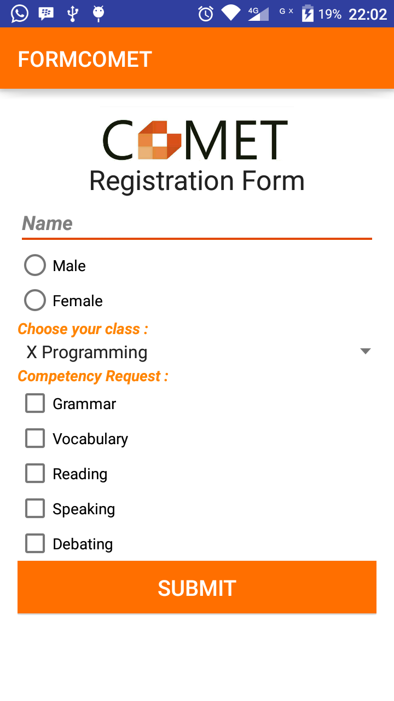
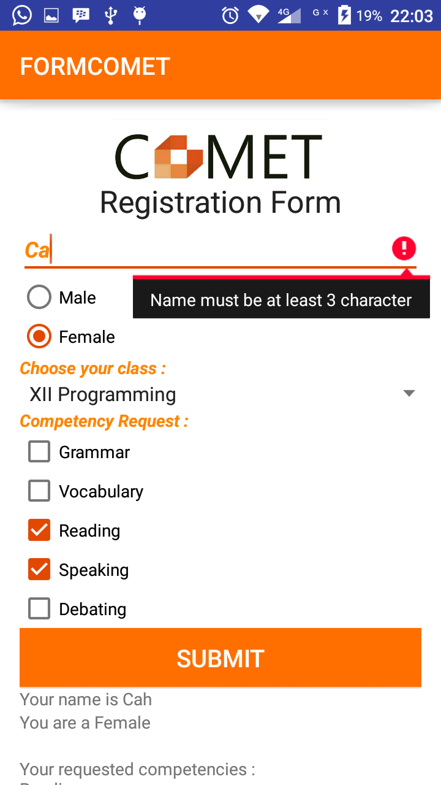
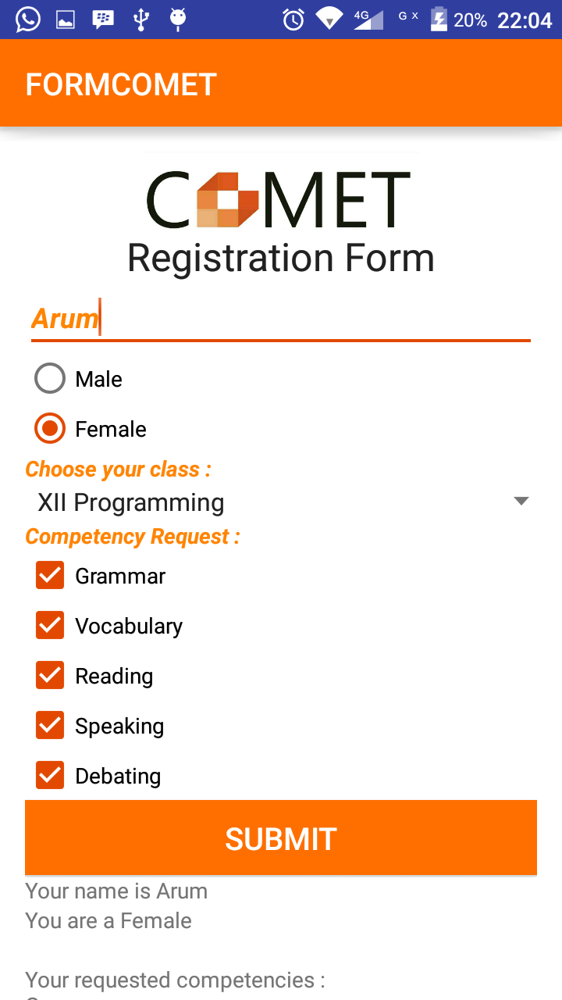
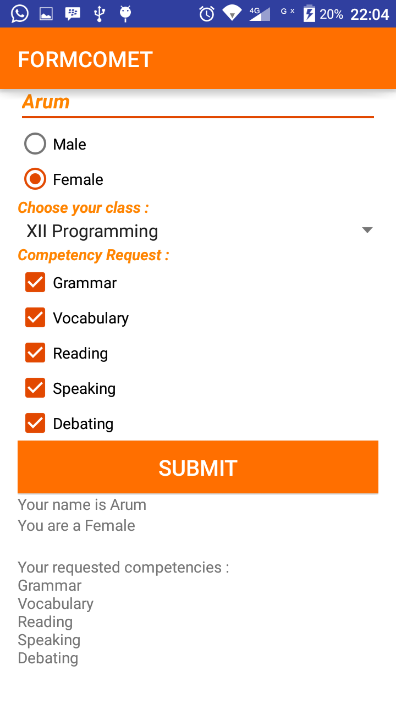

# FORMCOMET
## TugasPPB#001#XIIRP1#12

##### Penjelasan Aplikasi
Tema              : Formulir

Topik form isian  : Formulir Pendaftaran Club COMET

Isi               : 

1. Logo Club (Image View)

2. Judul (Text View)

3. Nama (Input Text)
                    
4. Jenis Kelamin (Radio Group dan Radio Button)
                    
5. Kelas (Spinner dropdown)
                    
6. Daftar kompetensi atau peminatan (Checkbox)
                    
7. Tombol (Button)
                    
8. Penampil hasil (Text View)

9. Scroll View
                    
Kegunaan          : Untuk memudahkan pengisian formulir sebuah club dari paper menjadi paperless

Deteksi kesalahan : Saat memasukkan nama yang berabjad <3, maka akan muncul pesan / message pemberitahuan bahwa nama minimal 3 karakter
isian         

##### Screenshoot Aplikasi

##### Link file apk dari aplikasi
[FORMCOMET](https://drive.google.com/file/d/0B3jMsq7wCWwYaUw1dFBQYzk5dEk/view?usp=sharing)

##### Identitas diri
Nama        : Cahyaningrum Argyanti Wijanarko

Kelas       : XII RPL 1

No Urut     : 12

NIS         : 4313/1211.070

Nama Sekolah: SMK Telkom Malang
